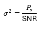

## Canal AWGN ##
Implementa um canal AWGN (Additive White Gaussian Noise), que é o modelo clássico de ruído usado em comunicações digitais.
Em resumo, ele pega o vetor de símbolos (BPSK ou QPSK) e adiciona ruído gaussiano com intensidade controlada pela SNR.

```python
# src/canal.py

import numpy as np

def adicionar_ruido_awgn(simbolos: np.ndarray, snr_db: float) -> np.ndarray:
    """
    Adiciona ruído AWGN a um vetor de símbolos (reais ou complexos).
    """
    snr_linear = 10 ** (snr_db / 10)

    # Energia média dos símbolos (vale para BPSK e QPSK normalizada)
    energia_simbolo = np.mean(np.abs(simbolos) ** 2)

    # Variância total do ruído
    sigma2 = energia_simbolo / snr_linear

    if np.iscomplexobj(simbolos):
        # Para sinal complexo, ruído em I e Q com sigma2/2 cada
        ruido_real = np.sqrt(sigma2 / 2) * np.random.randn(len(simbolos))
        ruido_imag = np.sqrt(sigma2 / 2) * np.random.randn(len(simbolos))
        ruido = ruido_real + 1j * ruido_imag
    else:
        # Para BPSK (real)
        ruido = np.sqrt(sigma2) * np.random.randn(len(simbolos))

    return simbolos + ruido
```


**adicionar_ruido_awgn(simbolos, snr_db)**

Objetivo:
Somar ruído gaussiano nos símbolos, usando um dado valor de SNR em dB.

```python
def adicionar_ruido_awgn(simbolos: np.ndarray, snr_db: float) -> np.ndarray:
```
Recebe:
- simbolos: contendo a sequÊncia transmitida
    - pode ser real (BPSK, Manchester)
    - ou complexo (QPSK)
- snr_db: valor da SNR desejada em decibéis


```python
snr_linear = 10 ** (snr_db / 10)
```
Converter SNR de dB para linear, aplicando a fórmula:


```python
# Energia média dos símbolos (vale para BPSK e QPSK normalizada)
    energia_simbolo = np.mean(np.abs(simbolos) ** 2)
```

Calcula a energia média dos símbolos
- Para BPSK, seus símbolos são −1 e +1
    → energia de cada símbolo = 1
    → energia média = 1
- Para QPSK, seus símbolos são normalizados por 1/√2
    → energia média ≈ 1 também

Logo, isso funciona tanto para BPSK quanto para QPSK.


```python
# Variância total do ruído
    sigma2 = energia_simbolo / snr_linear
```

Calcula a variância do ruído, de acordo com a fórmula que vem do modelo de canal AWGN:



onde:
- P_s: energia média do símbolo
- SNR: relação sinal-ruído
Isso define quanta interferência queremos adicionar.

