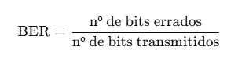

1. **Estrutura geral do Main**

```python
# main.py

import numpy as np
import matplotlib.pyplot as plt
import os
import csv

from src.modulacao import (
    bpsk_modular,
    bpsk_demodular,
    qpsk_modular,
    qpsk_demodular,
)
from src.canal import adicionar_ruido_awgn
from src.mensagem import texto_para_bits, bits_para_texto
from src.codificacao_linha import manchester_codificar, manchester_decodificar

```

- NumPy para operações numéricas
- Matplotlib para o gráfico
- os para criar a pasta results
- csv para gravar tabela

Importando as funções que implementam:
- modulação (BPSK e QPSK)
- canal AWGN
- conversão texto ↔ bits
- codificação Manchester


---

2. **Calcula BER (Bit Error Rate)**
```python
def calcular_ber(bits_tx, bits_rx) -> float:
    """Calcula a taxa de erro de bits (BER)."""
    if len(bits_tx) != len(bits_rx):
        raise ValueError("Vetores de bits com tamanhos diferentes.")
    erros = sum(b1 != b2 for b1, b2 in zip(bits_tx, bits_rx))
    return erros / len(bits_tx)
```

- Recebe os bits transmitidos (bits_tx) e recebidos (bits_rx).
- Conta quantos bits são diferentes → erros.
- Divide pelo número total de bits → BER.
Isso implementa diretamente a fórmula teórica:




---

3. **Simula BER (parte da modulação BPSK/QPSK)**
```python
def simular_ber(modular, demodular, snrs_db, num_bits: int, nome: str):
    """Simula BER x SNR para uma modulação genérica."""
    bers = []

    if nome.upper() == "QPSK" and num_bits % 2 != 0:
        num_bits += 1  # garante número par de bits

    print("\n" + "-" * 60)
    print(f"SIMULAÇÃO BER × SNR — {nome.upper()}")
    print(f"Bits por simulação: {num_bits:,}")
    print("-" * 60)

    for snr_db in snrs_db:
        bits_tx_np = np.random.randint(0, 2, size=num_bits)
        bits_tx = bits_tx_np.tolist()

        simbolos_tx = modular(bits_tx)
        simbolos_rx = adicionar_ruido_awgn(simbolos_tx, snr_db)
        bits_rx = demodular(simbolos_rx)

        # em QPSK, por segurança, corta qualquer excesso
        bits_rx = bits_rx[:len(bits_tx)]

        ber = calcular_ber(bits_tx, bits_rx)
        bers.append(ber)

        print(f"SNR = {snr_db:>2} dB | BER = {ber:.6e}")

    return bers
```

Recebe “quem modula” e “quem demodula”.
Se for QPSK, força o número de bits a ser par, porque QPSK agrupa 2 bits por símbolo.

Pra cada valor de SNR:
1.	Gera bits aleatórios: np.random.randint(0, 2, size=num_bits)
2.	Modula esses bits:
    - Se chamou com bpsk_modular → usa BPSK.
    - Se chamou com qpsk_modular → usa QPSK.
3.	Passa pelo canal AWGN com a SNR desejada: adicionar_ruido_awgn(simbolos_tx, snr_db)
4.	Demodula (decisão de símbolo → bits): bits_rx = demodular(simbolos_rx)
5.	Calcula BER com calcular_ber.
No final, devolve a lista de BERs (um valor pra cada SNR).


---

4. **Transmissão mensagem manchester (pipeline completo da mensagem fixa)**
```python
def transmitir_mensagem_manchester(mensagem: str, snr_db: float):
    """Pipeline completo com Manchester + canal AWGN."""

    bits_tx = texto_para_bits(mensagem)
    niveis_tx = manchester_codificar(bits_tx)
    niveis_tx_np = np.array(niveis_tx, dtype=float)

    niveis_rx_continuo = adicionar_ruido_awgn(niveis_tx_np, snr_db)

    # decisão de nível
    niveis_rx = [1 if v > 0 else -1 for v in niveis_rx_continuo]

    # decodificação
    bits_rx = manchester_decodificar(niveis_rx)
    mensagem_rx = bits_para_texto(bits_rx)

    # BER
    ber = calcular_ber(bits_tx, bits_rx)

    return mensagem_rx, ber, len(bits_tx)
```
<br>

- **Texto → bits**
    ```python
    bits_tx = texto_para_bits(mensagem)
    ```
    - Usa texto_para_bits (de src/mensagem.py).
    - Cada caractere vira 8 bits (ASCII).
<br>


- **Bits → codificação Manchester (níveis +1/-1)**
    ```python
    niveis_tx = manchester_codificar(bits_tx)
    niveis_tx_np = np.array(niveis_tx, dtype=float)
    ```
    - manchester_codificar pega cada bit e transforma em dois níveis:
        - 0 → [-1, +1]
        - 1 → [+1, -1]
    - niveis_tx_np é só para transformar em array NumPy para facilitar o uso no canal.


- **Passa pelo canal AWGN**
    ```python
    niveis_rx_continuo = adicionar_ruido_awgn(niveis_tx_np, snr_db)
    ```

    - adicionar_ruido_awgn soma ruído gaussiano controlado por snr_db.
    - Agora você tem um sinal “sujo”: os valores não são mais exatamente +1 e −1, são algo tipo 0.8, −1.2, etc.

<br>
- **Decisão de nível**
    ```python
    # decisão de nível
    niveis_rx = [1 if v > 0 else -1 for v in niveis_rx_continuo]
    ```

    Regra: se o valor > 0 → decide que é +1, se ≤ 0 → decide que é −1.
    Isso é a decisão de símbolo com limiar 0.


- **Decodificação Manchester → bits / Bits → texto**
    ```python
    # decodificação
    bits_rx = manchester_decodificar(niveis_rx)
    mensagem_rx = bits_para_texto(bits_rx)
    ```

    - manchester_decodificar pega os pares de níveis e decide se foi 0 ou 1.
    - Ele também é robusto a erro: se o par não bater justamente com o ideal, analisa o valor médio.
    - bits_para_texto agrupa os bits de 8 em 8 e reconstrói a string final.
<br>


- **Cálculo da BER da mensagem**
    ```python
    # BER
    ber = calcular_ber(bits_tx, bits_rx)

    return mensagem_rx, ber, len(bits_tx)
    ```
    - Compara bits_tx (originais) com bits_rx (decodificados) → BER.
    - Também retorna o número de bits, para mostrar no log.

---
<br>

5. **Função main()**

```python
def main():

    os.makedirs("results", exist_ok=True)
```

Garante que a pasta results/ exista (cria se não existir).

5.1. Parte 1 - Demonstração Manchester
```python
    # ============================================================
    # Parte 1 — Demonstração Manchester
    # ============================================================

    print("=" * 70)
    print("DEMONSTRAÇÃO: Manchester + Canal AWGN")
    print("=" * 70)

    mensagem = "REDES DE COMPUTADORES 2025"

    with open("results/pipeline_manchester_log.txt", "w", encoding="utf-8") as flog:
        flog.write("Demonstração do pipeline completo com Manchester + canal AWGN\n")
        flog.write(f"Mensagem original: {mensagem}\n\n")
```

- Define a mensagem fixa.
- Abre o arquivo de log para escrever os resultados.

<br>
<br>

```python
for snr_db in [2, 5, 10]:
            mensagem_rx, ber, nbits = transmitir_mensagem_manchester(mensagem, snr_db)

            bloco = (
                "-" * 60 + "\n"
                f"SNR = {snr_db} dB\n"
                f"Número de bits transmitidos: {nbits}\n"
                f"Mensagem transmitida : {mensagem}\n"
                f"Mensagem recebida    : {mensagem_rx}\n"
                f"BER = {ber:.6f}\n"
                + "-" * 60 + "\n\n"
            )

            print(bloco)
            flog.write(bloco)
```


Pra cada SNR (2, 5, 10 dB):
- Chama transmitir_mensagem_manchester → executa TODO o pipeline:
    texto → bits → Manchester → AWGN → decisão → decodificação → texto → BER
- Formata um bloco com:
    - SNR
    - nº de bits
    - mensagem original
    - mensagem recebida
    - BER
- Imprime esse bloco no terminal e grava no log em results/pipeline_manchester_log.txt.

