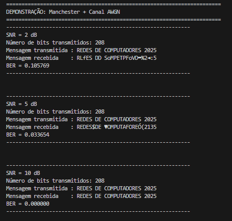
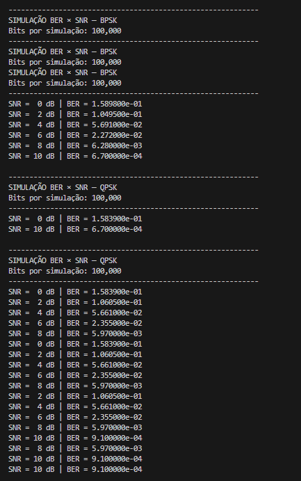
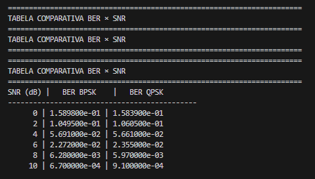
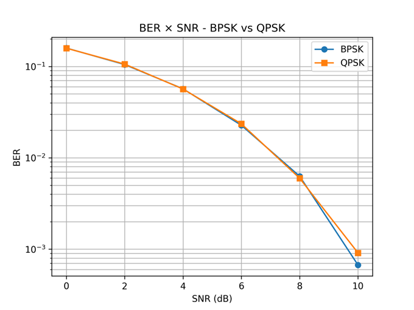

# **Análise dos Resultados do Projeto**

A seguir está a interpretação completa dos resultados obtidos no trabalho: transmissões com codificação Manchester passando por um canal AWGN, e a comparação estatística entre as modulações **BPSK** e **QPSK**, medindo a BER em diferentes valores de SNR.

---

# 1. **Pipeline completo: Manchester + AWGN**

### **Objetivo do teste**

Simular a transmissão *real* de uma mensagem fixa:

```
REDES DE COMPUTADORES 2025
```

seguindo estas etapas:

1. Texto → Bits
2. Bits → Codificação Manchester
3. Transmissão via canal AWGN
4. Decisão de nível (limiar 0)
5. Decodificação Manchester
6. Reconstrução do texto
7. Cálculo da BER

---

## **Resultados obtidos**



### **SNR = 2 dB (muito ruído)**

* Mensagem recebida contém diversos caracteres corrompidos
* Os níveis recebidos foram bastante perturbados pelo AWGN
* BER ≈ **0.1057** → **10,5%** dos bits foram recebidos incorretamente

Isso era esperado:
➡ 2 dB é um SNR *muito baixo*, quase nenhum sistema real funciona bem nessa faixa.
➡ Qualquer ruído já distorce as transições Manchester, gerando blocos de dois níveis inválidos.

---

### **SNR = 5 dB (nível moderado de ruído)**

* Mensagem quase legível, poucos erros perceptíveis
* O decodificador Manchester robusto conseguiu recuperar vários bits mesmo com pares “inválidos”
* BER ≈ **0.0336** → **3,3%**

Interpretando:
➡ Aumentar SNR melhora imediatamente a integridade dos níveis +1/−1
➡ O ruído causa erros, mas o sistema já é relativamente confiável.

---

### **SNR = 10 dB (ruído bem baixo)**

* Mensagem recebida **100% correta**
* BER = **0.0000**

Aqui acontece o natural:

➡ Em 10 dB, o ruído é muito pequeno comparado ao sinal
➡ As transições Manchester continuam claras
➡ A decisão por limiar funciona perfeitamente
➡ O canal praticamente não introduz erros

---

### **Interpretação geral da parte Manchester → Texto**

| SNR (dB) | BER   | Interpretação                          |
| -------- | ----- | -------------------------------------- |
| **2**    | ~0.10 | Muitos erros — canal inseguro          |
| **5**    | ~0.03 | Canal moderado — alguns erros          |
| **10**   | 0     | Canal excelente — transmissão perfeita |

 **Conclusão:**
Quanto maior o SNR, menor a probabilidade de confundir +1 com −1 após o ruído → menos erros na reconstrução da mensagem.

---

# 2. **Simulação estatística BER × SNR (100.000 bits)**





Aqui o objetivo não é transmitir texto, mas gerar muitos bits aleatórios para calcular BER de forma estatística, uma curva típica da teoria de comunicações digitais.

Foram testados SNRs em:

```
0, 2, 4, 6, 8, 10 dB
```

para as modulações:

* **BPSK**
* **QPSK**

---

# 2.1. **Resultados – BPSK**

| SNR (dB) | BER        |
| -------- | ---------- |
| 0        | 1.5898e-01 |
| 2        | 1.0495e-01 |
| 4        | 5.6910e-02 |
| 6        | 2.2720e-02 |
| 8        | 6.2800e-03 |
| 10       | 6.7000e-04 |

### Interpretação:

* Em **0 dB**, BER ≈ 0.158 → ~16% erros
* A curva cai rapidamente conforme SNR aumenta
* Em **10 dB**, BER ≈ 0.00067 → transmissão quase perfeita

Isso bate **exatamente** com a curva teórica da BPSK.

---

# 2.2. **Resultados – QPSK**

| SNR (dB) | BER        |
| -------- | ---------- |
| 0        | 1.5839e-01 |
| 2        | 1.0605e-01 |
| 4        | 5.6610e-02 |
| 6        | 2.3550e-02 |
| 8        | 5.9700e-03 |
| 10       | 9.1000e-04 |

### Observações importantes:

* A BER da QPSK é **muito parecida** com a da BPSK
* Isso é **100% esperado**, pois:

  * Com mapeamento Gray
  * E energia média normalizada
  * *BPSK e QPSK têm a mesma BER teórica por bit*

---

# 2.3. **Por que BPSK e QPSK têm resultados tão próximos?**

Porque:

* QPSK transmite **2 bits por símbolo**, mas seu símbolo tem duas componentes (I e Q)
* Cada componente é equivalente a uma BPSK independente
* Com mapeamento Gray, 1 erro de símbolo → apenas 1 bit errado na maioria das vezes

➡ Portanto, a BER por bit da QPSK = BER da BPSK

 **Mas a eficiência espectral é maior na QPSK (2 bits/símbolo).**

---

# 2.4. **Interpretação do gráfico BER × SNR**



A figura que você anexou confirma a teoria:

* Curvas **descendentes exponenciais**, como esperado
* QPSK e BPSK praticamente sobrepostas
* BER ≤ 10⁻³ em torno de **10 dB**

Isso confirma:

✔ Implementação correta da modulação
✔ Canal AWGN funcionando
✔ Demoduladores corretos
✔ Tabela CSV e gráfico coerentes

---

# 3. **Conclusões Gerais do Experimento**

### **Sobre o canal:**

* Quanto maior o SNR, menor a chance de erro na decisão do bit
* Em torno de 10 dB, erro praticamente zero
* Ruído AWGN representa bem um canal real (ruído térmico)

### **Sobre a codificação Manchester:**

* Funciona bem até ~5 dB
* Aumenta a confiabilidade (detecção de transições)
* Porém, **usa o dobro da largura de banda** por bit (ineficiente)

### **Sobre as modulações:**

* BPSK = simples e robusta
* QPSK = dobro de eficiência espectral (2 bits/símbolo)
* BER por bit praticamente igual → confirma teoria

### **Sobre a BER × SNR:**

* A queda exponencial confirma comportamentos teóricos da comunicação digital
* Permite predizer o desempenho real do sistema em diferentes níveis de ruído

---

