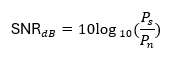

# Conceitos envolvidos e análise

## Codificação de canal vs codificação de linha (Manchester)
Na teoria de comunicações, “codificação de canal” geralmente significa técnicas de correção de erro (Hamming, Reed–Solomon, LDPC etc.).
Este projeto é focado em codificação de linha (Manchester), que é um tipo de codificação no domínio do tempo:
- Função principal da Manchester:
    - Garantir sincronismo de relógio entre transmissor e receptor.
    - Ter componente DC baixa (sinal balanceado +1/−1).
- Característica importante:
    - o	Cada bit vira dois intervalos (dois símbolos de linha) → isso dobra a taxa de símbolos na linha e dobra a largura de banda necessária comparado com um código simples (NRZ).

Manchester melhora a robustez de sincronismo, mas piora a eficiência espectral (precisa de mais banda para o mesmo número de bits).
Isso aparece nos resultados deste projeto, justamente porque, mesmo com um canal relativamente simples (AWGN), a Manchester torna o sinal mais tolerante a erros de amostragem e sincronismo, mas “gasta” o dobro de taxa de símbolos.

## Modulação digital: BPSK e QPSK
A modulação é a etapa que converte bits em sinais adequados para o canal físico.
- BPSK (Binary Phase Shift Keying):
    - Cada bit é mapeado em uma fase (ou, na implementação deste projeto, em um valor real):
        - 0 → −1
        - 1 → +1
    - Cada símbolo carrega 1 bit de informação.
    - Constelação: dois pontos na linha real.

- QPSK (Quadrature PSK):
    - Agrupa 2 bits por símbolo.
    - Usa dois eixos (I e Q): quatro combinações possíveis (00, 01, 11, 10) → quatro pontos na constelação.
    - Cada símbolo carrega 2 bits.
    - Constelação: quatro pontos no plano complexo, geralmente em 45°, 135°, 225°, 315°, normalizados por 1/√2.

## Canal AWGN, SNR e BER
O canal AWGN implementado é o modelo clássico de um canal com:
- ruído gaussiano (distribuição normal)
- branco (mesma potência em todas as frequências)
- aditivo (soma ao sinal transmitido)
O parâmetro que controla a intensidade do ruído é a SNR (Signal-to-Noise Ratio), que aqui foi usado decibéis:
    

- SNR baixa (0–2 dB) → muito ruído → BER alta
- SNR alta (8–10 dB) → pouco ruído → BER baixa, mensagem quase perfeita

## Eficiência espectral
Eficiência espectral é, resumidamente, quantos bits por segundo por Hertz (b/s/Hz) conseguimos transmitir.
1. BPSK
- 1 bit por símbolo.
- Eficiência básica: 1 b/s/Hz (se a largura de banda for igual à taxa de símbolos).

2. QPSK
- 2 bits por símbolo.
- Para a mesma taxa de símbolos e mesma banda, temos 2 b/s/Hz → o dobro da eficiência do BPSK.

3. Efeito da Manchester
- Cada bit vira 2 intervalos (dois “meios bits” na linha).
- Na prática, para manter a mesma taxa de bits, você precisa do dobro da largura de banda.
- Isso reduz a eficiência espectral em um fator 2.

4. Combinações
- Manchester + BPSK
    - BPSK: 1 bit por símbolo
    - Manchester: dobra o número de símbolos de linha por bit
    - → Eficiência efetiva ≈ 0,5 b/s/Hz

- Manchester + QPSK
    - QPSK: 2 bits por símbolo
    - Manchester: dobra a taxa na linha
    - → Eficiência efetiva ≈ 1 b/s/Hz